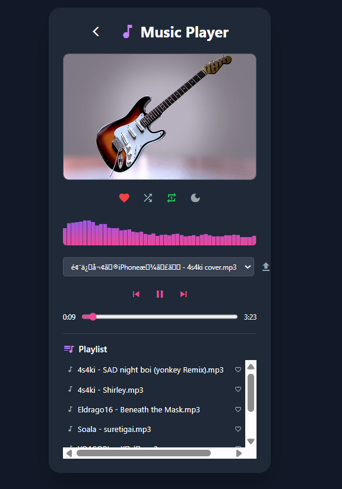

# Simple Music Player



A modern, user-friendly web-based music player built with Node.js, Express, and Tailwind CSS. This app lets you play your local MP3 files in a beautiful, responsive interface with interactive features like song liking, repeat-once, shuffle, and dynamic album art fetched from Pixabay API.

---

## 🎵 Features That Make Your Music Experience Exceptional

- **🎶 Song Selection Made Easy:**
  - Automatically detects `.mp3` files from your local `public/Music` folder.
  - Choose songs effortlessly from a dropdown menu.

- **🎛️ Intuitive Playback Controls:**
  - **Play / Pause:** Seamlessly toggle playback with large, responsive buttons.
  - **Next / Previous:** Navigate through your playlist with ease.
  - **Progress Slider:** Jump to your favorite part of the song with a smooth slider.

- **❤️ Like Your Favorites:**
  - Mark songs as favorites with a single click on the heart icon.
  - Favorites are visually highlighted for quick access.

- **🔁 Repeat Modes:**
  - Replay the current song once with the repeat-one mode.
  - Enable continuous looping for the current song.
  - Visual feedback ensures you know when repeat modes are active.

- **🔀 Shuffle for Surprise:**
  - Enable shuffle mode to enjoy songs in a random order.
  - The shuffle icon changes color to indicate activation.

- **🖼️ Dynamic Album Art:**
  - Each song is paired with a random, high-quality album art image fetched from Pixabay API.
  - Adds a visually stunning touch to your listening experience.

- **📱 Responsive Design:**
  - Built with Tailwind CSS for a sleek, modern look that adapts to any device.

---

## 🚀 Getting Started

### 1. Clone or Download the Repository
```sh
git clone https://github.com/Aadi1909/musicplayer.git
cd musicplayer
```
Or download and extract the ZIP, then open the folder in your terminal.

### 2. Install Dependencies
```sh
npm install
```

### 3. Add Your Music Files
Place your `.mp3` files inside the `public/Music` directory. The app will automatically detect and list all MP3s in this folder.

### 4. Start the Server
```sh
npm start
```
Or, if there is no `start` script in `package.json`, run:
```sh
node server.js
```

### 5. Open the App
Go to [http://localhost:3000](http://localhost:3000) in your browser.

---

## 🗂️ Project Structure
```
public/
  index.html        # Main frontend UI
  script.js         # Frontend logic (fetches songs, controls player)
  Music/            # Place your MP3 files here
  utils/utils.js    # Utility functions for the player
server.js           # Express server (serves frontend and API)
package.json        # Project metadata and dependencies
```

---

## ⚙️ How It Works
- The Express server serves static files from `public/` and exposes an API endpoint `/api/songs` to list available MP3 files.
- The frontend fetches the song list and allows you to play them using the built-in HTML5 `<audio>` element.
- Album art images are dynamically fetched from Pixabay API.
- All controls and features are handled client-side for a smooth, interactive experience.

---

## 📝 Notes
- Only `.mp3` files in the `public/Music` directory will be listed.
- CORS is enabled for audio streaming.
- Tested on modern browsers (Chrome, Edge, Firefox).

---

## 🔮 Upcoming Features
- **Folder and File Uploading:**
  - Upload entire folders or individual audio files directly from the browser to your music library.
- **Playlist Management:**
  - Create, edit, and save playlists for custom listening experiences.
  - A dedicated page for listing all playlists and songs, making navigation and organization easier.
- **Persistent Favorites:**
  - Save your liked songs and playlists across sessions (local storage or backend support).
- **Improved Mobile Experience:**
  - Enhanced touch controls and mobile UI improvements.

---

## 📄 License
This project is for educational and personal use.
